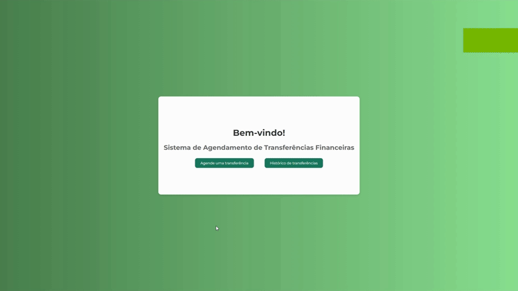

# Sistema de Agendamento de Transferências Financeiras
Projeto de envio para avaliação da empresa Tokio Marine, a proposta é criar uma API em Java, juntamente com uma interface web em Angular, para realizar agendamentos de transferências financeiras, de acordo com a proposta apresentada pela empresa: <b>[Avaliação Fullstack](TM-Avaliacao.md)</b>.

### 💻 Tecnologias e Software utilizadas




### Requisições
- <b>POST:</b> url/transferencias/agendar: realizará o cadastro de agendamento de transferência financeiro.
- <b>GET:</b> url/transferencias/agendamentos: Retorna uma lista de todos os agendamentos cadastrados
- <b>DELETE:</b> url/transferencias/agendamentos/{id}: Deleta o agendamento realizado.

```json

{
    "contaOrigem": 635241,
    "contaDestino": 784512,
    "valorTransferencia": 650,
    "dataTransferencia": "2024-02-25"
}

```

### Retorno
```json

{
    "id": 1,
    "contaOrigem": 635241,
    "contaDestino": 784512,
    "valorTransferencia": 650,
    "taxa": 11.050,
    "dataTransferencia": "2024-02-25",
    "dataAgendamento": "2024-01-07",
    "valorTotal": 661.050
}

```